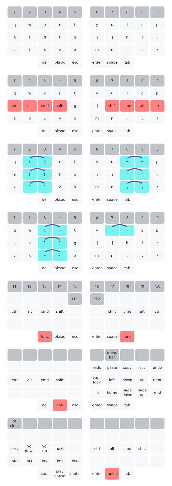

# Keymap
Legend:
- Keys joined by a short arc are combos, accessed by pressing both keys at once
- Red keys are held to access layers or modifiers

## [46-key](https://github.com/BrokenFlows/zmk-brokenflows/blob/master/config/ishka.keymap)

